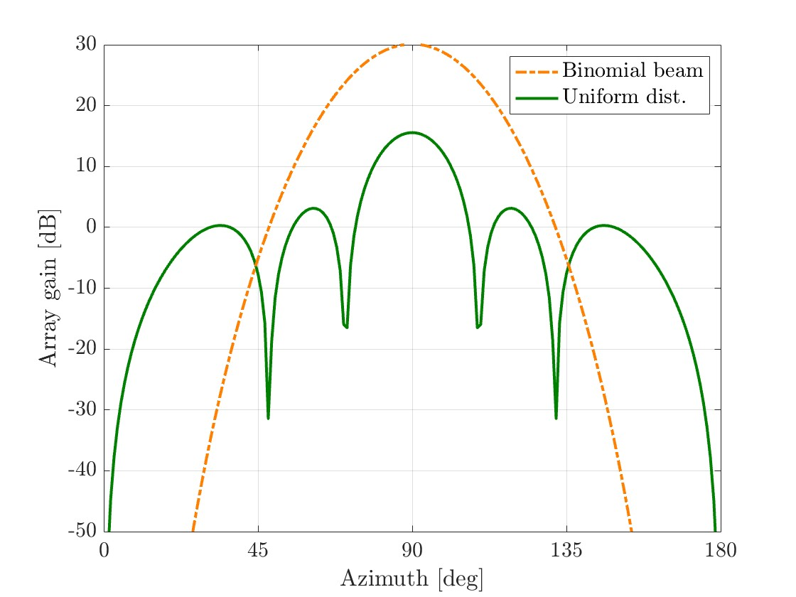
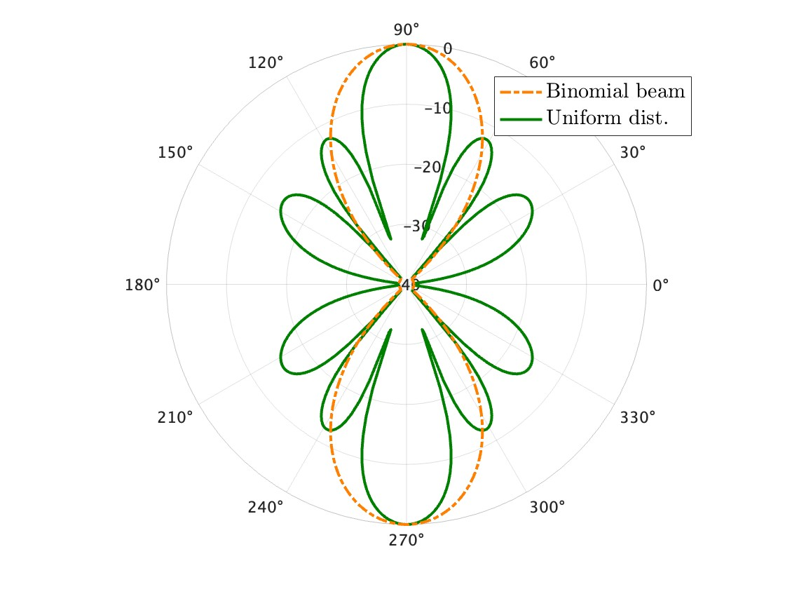

# AntennaPattern
Calculate the array factor and plot the directivity of array antenna

## Sample
Uniform and binomial arrays were prepared as array antennas. Let us illustrate these antenna patterns.  
You can calculate and plot the antenna directivity like this.

Also you can plot the antenna pattern in polar coordinates.

### Notice
We consider the *uniform linear array (ULA)*.
If you want to apply this function to *phased linear array (PLA)*, please calculate the elevation previously.
