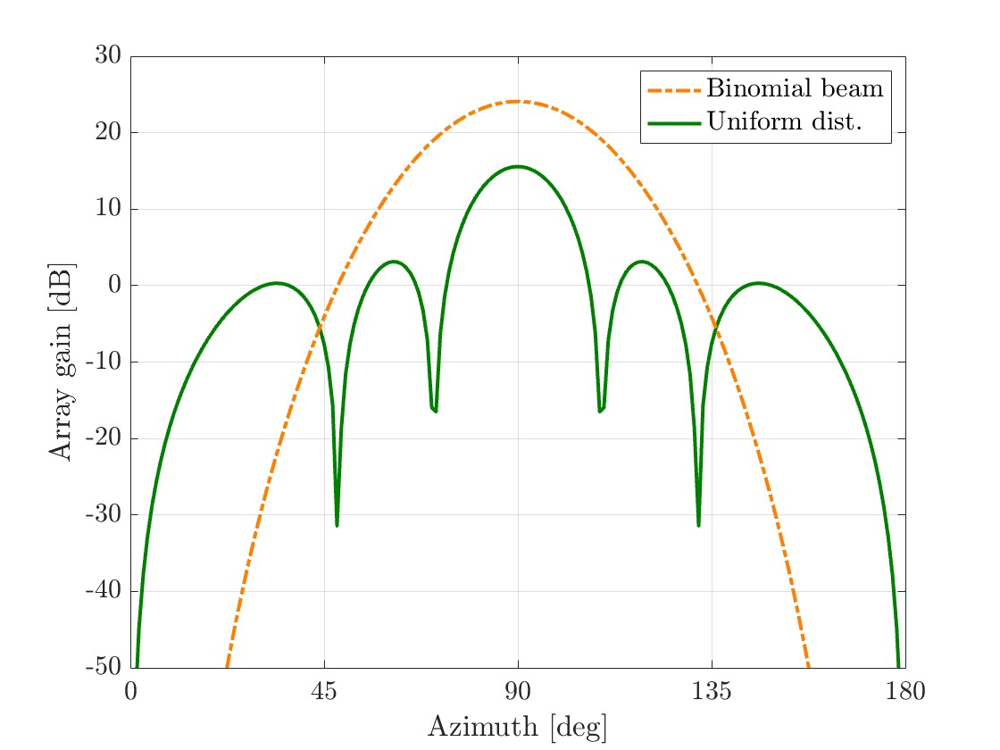

# AntennaPattern
Calculate the array factor and plot the directivity of array antenna

## Sample
You can calculate and plot the antenna directivity like this.

## Notice
We consider the *uniform linear array (ULA)*.
If you want to apply this function to *phased linear array (PLA)*, please calculate the elevation previously.
