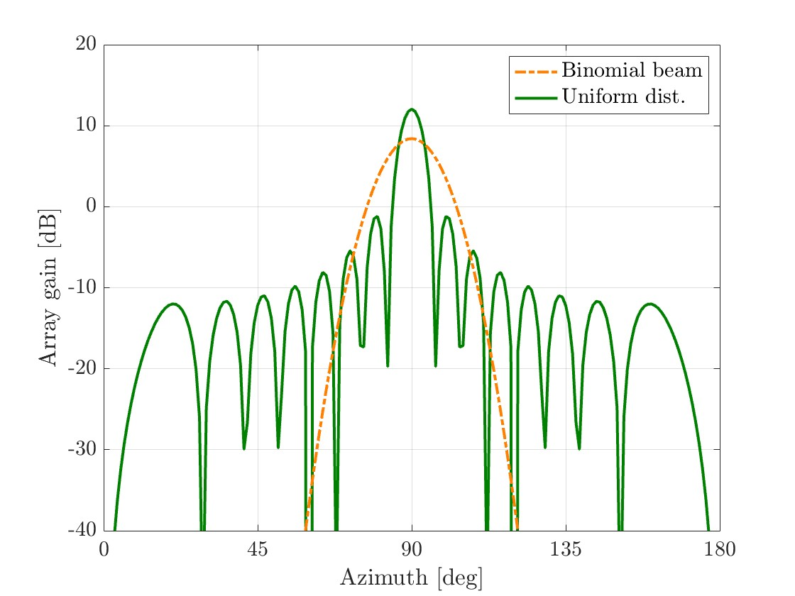
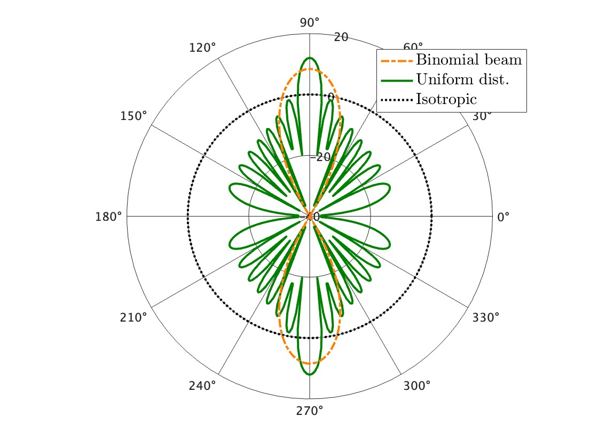

# AntennaPattern
Calculate array factors and plot directivity patterns of array antenna

## Examples
Uniform and binomial arrays were prepared as array antennas. Let us illustrate these antenna patterns.  
We can calculate and plot the antenna directivity like this.

Also we can plot the antenna pattern in polar coordinates. (Note that the array gains are normalized here.)

### Notice
We consider the *uniform linear array (ULA)*.
If you want to apply this function to *uniform planar array (UPA)*, please calculate the elevation previously.
